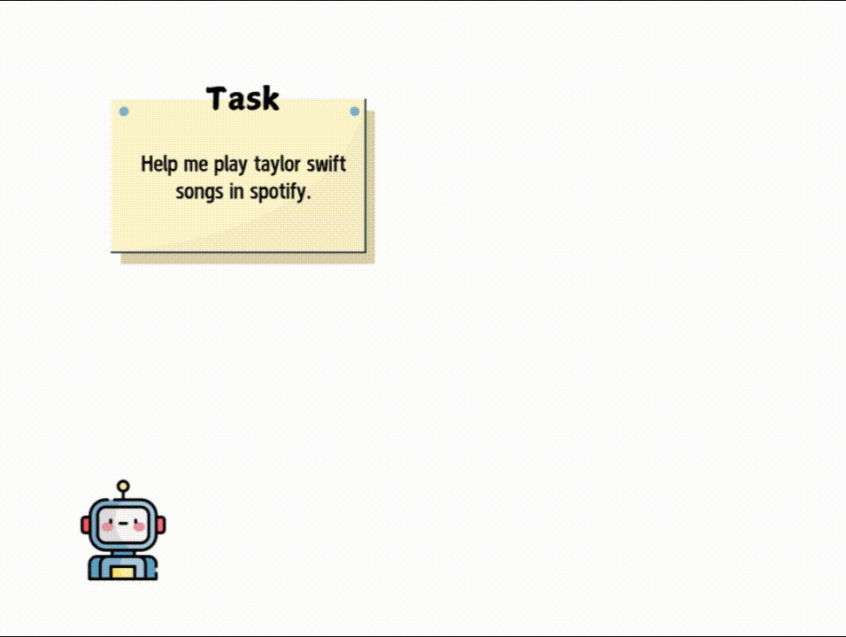

<p align="center">
  <h1 align="center">AppAgentX: Evolving GUI Agents as Proficient Smartphone Users</h1>
  <p align="center">
    <strong>Wenjia Jiang</strong><sup>1, 2</sup>
    &nbsp;&nbsp;
    <strong>Yangyang Zhuang</strong><sup>1</sup>
    &nbsp;&nbsp;
    <strong>Chenxi Song</strong><sup>1</sup>
    &nbsp;&nbsp;
    <strong>Xu Yang</strong><sup>3</sup>
    &nbsp;&nbsp;
    <strong>Joey Tianyi Zhou</strong><sup>4,5</sup>
    &nbsp;&nbsp;
    <strong>Chi Zhang</strong><sup>1</sup>
    <br>
    <sup>1</sup>AGI Lab, Westlake University,</span>&nbsp;
    <sup>2</sup>Henan University,</span>&nbsp;
    <sup>3</sup>Southeast University</span>&nbsp;
    <sup>4</sup>IHPC, Agency for Science, Technology and Research, Singapore</span>&nbsp;
    <sup>5</sup>CFAR, Agency for Science, Technology and Research, Singapore</span>&nbsp;
    <br>
    <a href="mailto:jiangwenjia@westlake.edu.cn">jiangwenjia@westlake.edu.cn</a>
    <br>
    <a href='https://arxiv.org/abs/2503.02268'></a>&nbsp;
    <a href='https://appagentx.github.io/'></a>&nbsp;
    <a href='https://appagent-official.github.io/'></a>&nbsp;
    <br>
    
  </p>
  <br>
</p>

## Abstract

Recent advancements in Large Language Models (LLMs) have led to the development of intelligent LLM-based agents capable of interacting with graphical user interfaces (GUIs). These agents demonstrate strong reasoning and adaptability, enabling them to perform complex tasks that traditionally required predefined rules. However, the reliance on step-by-step reasoning in LLM-based agents often results in inefficiencies, particularly for routine tasks. In contrast, traditional rule-based systems excel in efficiency but lack the intelligence and flexibility to adapt to novel scenarios.
To address this challenge, we propose a novel evolutionary framework for GUI agents that enhances operational efficiency while retaining intelligence and flexibility. Our approach incorporates a memory mechanism that records the agent's task execution history. By analyzing this history, the agent identifies repetitive action sequences and evolves high-level actions that act as shortcuts, replacing these low-level operations and improving efficiency. This allows the agent to focus on tasks requiring more complex reasoning, while simplifying routine actions.
Experimental results on multiple benchmark tasks demonstrate that our approach significantly outperforms existing methods in both efficiency and accuracy. The code will be open-sourced to support further research.

## 🚀Getting Started

Before diving into the setup, it's worth mentioning that **DeepSeek**  can be used with an OpenAI-compatible API format. By modifying the configuration, you can use the OpenAI SDK to access the DeepSeek API.

### 1. LLM Setup and Dependencies

This project utilizes LangChain and LangGraph to construct the agent framework. It is recommended to follow the installation methods suggested on their official websites. For other dependencies, please use `pip install -r requirements.txt`. For LLM configuration, adjust the relevant settings in the `config.py` file.

### 2. Database Deployment and Connection

We use Neo4j as the memory storage for the agent, leveraging its Cypher query language to facilitate node retrieval. For vector storage, Pinecone is employed. Ensure that the necessary API and keys are configured in the `config.py` file. For more information, visit [Neo4j's official site](https://neo4j.com) and [Pinecone's official site](https://www.pinecone.io).

### 3. Screen Recognition and Feature Extraction Deployment

To simplify deployment, we use Docker to containerize the screen recognition and feature extraction services. Refer to the README in the backend folder for instructions on starting the container. Note that this may require Docker's GPU support; please consult Docker's official documentation for configuration. This modular approach allows for easy replacement of different screen parsing and feature extraction tools, significantly enhancing the model's scalability. If you need to deploy, please refer to the [README file](./backend/README.md) in the backend folder of the current project.

### 4. Launching the Demo

To use this project, you first need to configure **ADB (Android Debug Bridge)** to connect your Android device to your computer.

#### **1. Setting Up ADB and Connecting Your Device**

1. **Install ADB on your PC**:  
   Download and install _Android Debug Bridge (adb)_—a command-line tool that enables communication between your PC and an Android device.

2. **Enable USB Debugging** on your Android device:

   - Go to **Settings** > **Developer Options** and enable **USB Debugging**.

3. **Connect your device to the PC** using a USB cable.

#### **Using an Emulator Instead of a Physical Device (Optional)**

If you do not have an actual Android device but still want to try **AppAgent**, we recommend using the built-in emulator in **Android Studio**:

1. Download and install **Android Studio**.
2. Open **Device Manager** in Android Studio to create and launch an emulator.
3. Install apps on the emulator by downloading APK files and dragging them into the emulator window.
4. **AppAgent** can detect and operate apps on an emulator just like on a real device.

#### **Launching Gradio**

Once your device or emulator is set up, you can start the project. We use **Gradio** as the front-end interface. Use one of the following commands to launch the demo:

```sh
python demo.py
```

or

```sh
gradio demo.py
```

Now, **AppAgent** should be ready to use! 🚀

## 📷 Screenshots and Demo

Below are several screenshots of AppAgentX after deployment:

<div align="center">
<table width="100%">
  <tr>
    <td align="center" width="50%">
      <strong>Initial Interface</strong><br>
      
    </td>
    <td align="center" width="50%">
      <strong>Automatic Exploration</strong><br>
      
    </td>
  </tr>
  <tr>
    <td align="center" width="50%">
      <strong>Chain Execution</strong><br>
      
    </td>
    <td align="center" width="50%">
      <strong>Execution Results</strong><br>
      
    </td>
  </tr>
</table>
</div>

Here are demonstration GIFs of AppAgentX:




## 🔗 Related Links

- [AppAgent](https://arxiv.org/abs/id) - First LLM-based intelligent smartphone application agent
- [OmniParser](https://github.com/microsoft/OmniParser) - Microsoft's multimodal interface parsing tool
- [LangChain](https://github.com/langchain-ai/langchain) - Framework for building LLM-powered applications

## 📚 BibTeX

If you find our repo helpful, please consider leaving a star or cite our paper :)

```bibtex
@misc{jiang2025appagentxevolvingguiagents,
      title={AppAgentX: Evolving GUI Agents as Proficient Smartphone Users},
      author={Wenjia Jiang and Yangyang Zhuang and Chenxi Song and Xu Yang and Chi Zhang},
      year={2025},
      eprint={2503.02268},
      archivePrefix={arXiv},
      primaryClass={cs.AI},
      url={https://arxiv.org/abs/2503.02268},
}
```

## 📭 Contact

If you have any comments or questions, feel free to contact [Wenjia Jiang](jiangwenjia@westlake.edu.cn).
